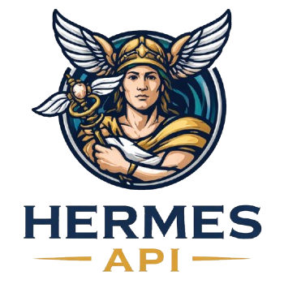

<p align="center">
    
</p>

<p align="center">
    <em>Hermes API, uma API mensageira</em>
</p>

# Sobre

API para uso no Grafana, com conexão com Oracle

## Instalação

Crie um ambiente e instale as dependências

```
python -m venv .venv
```
```
source .venv/bin/activate
```
```
pip install -r requirements.txt
```

## Oracle Instantclient

## Iniciando a API

```
uvicorn app.main:app --reload --host 0.0.0.0 --port 8000
```
